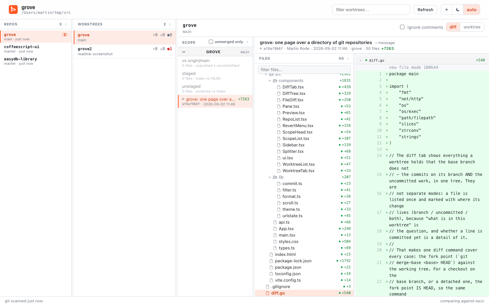
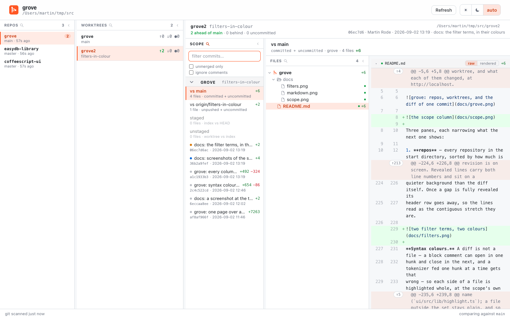
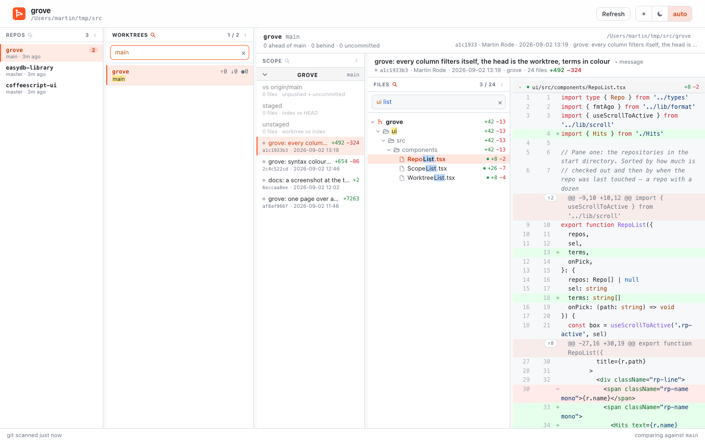
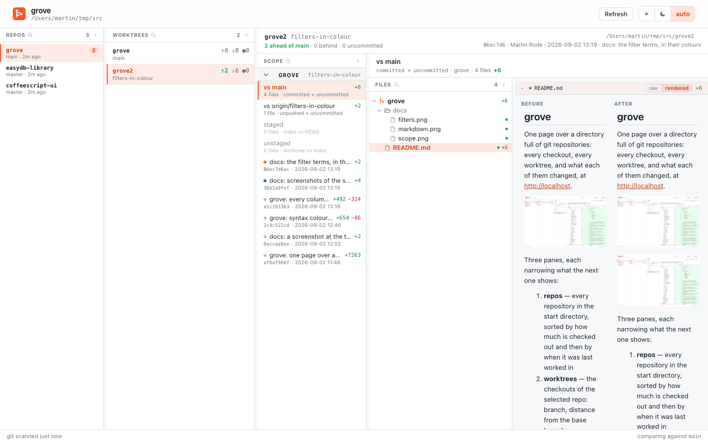

# grove

One page over a directory full of git repositories: every checkout, every
worktree, and what each of them changed, at http://localhost.



Three panes, each narrowing what the next one shows:

1. **repos** — every repository in the start directory, sorted by how much is
   checked out and then by when it was last worked in
2. **worktrees** — the checkouts of the selected repo: branch, distance from
   the base branch, uncommitted count
3. **viewer** — the selected worktree: what is known about it in the head, its
   diff below

grove reads git and nothing else. It never starts, stops or reconfigures
anything. The single exception is the diff tree's context menu — see
[Unstage and discard](#unstage-and-discard).

## Install

```sh
go install github.com/programmfabrik/grove@latest
cd ~/src && grove          # http://localhost
```

macOS, Windows and Linux — CI builds and tests all three on every push.

It needs `git` on the path, nothing else, and says so and stops when it is
missing rather than serving a dashboard of empty panes. On Windows it also
looks where Git for Windows installs itself, since a program started from an
icon does not always inherit the PATH entry that puts git there.

Started with no arguments it takes the working directory, or its repo's parent
when started inside a checkout — so `cd myrepo && grove` lists everything next
to myrepo, not myrepo alone. `-dir` overrides.

**Where it listens.** Port 80 is what makes it `http://localhost`, and macOS
lets an unprivileged process bind it. Linux keeps everything under 1024 for
root and on Windows http.sys may already hold it, so when the default cannot
be had grove moves to `127.0.0.1:7433` and prints where it went. An explicit
`-addr` is taken literally: you named a port, and quietly using a different one
would be a lie about where the dashboard is.

It binds the loopback interface and not the wildcard. grove reads every
repository on the machine and has one endpoint that deletes untracked files, so
a dashboard the rest of the network can reach is not a default anybody asked
for. `-addr :80` restores it for whoever wants it.

| flag | default | |
| --- | --- | --- |
| `-addr` | `127.0.0.1:80`, or `127.0.0.1:7433` when that is taken | listen address |
| `-dir` | the working directory, or its repo's parent | the directory holding the repositories |
| `-base` | the branch of the main checkout | what ahead/behind and the branch diff compare against |
| `-refresh` | `20s` | how often the worktrees are re-scanned |
| `-open` | off | open the browser once it listens |

## What it discovers, and how

| shown | where it comes from |
| --- | --- |
| the repo list | the top level of the start directory, entries with a `.git`; each resolved through `git rev-parse --git-common-dir` so a linked worktree is not listed as a repo of its own |
| a repo's worktrees | `git worktree list --porcelain` on the repo — which reports them wherever they live, a sibling directory of worktrees included. The main checkout comes first, the rest in natural order of their names (`wt2` before `wt10`) |
| last used | the newest of the last commit and `.git/HEAD`'s mtime. **Not** `.git`'s mtime: reading a repo touches that, so a dashboard that scans every repo would make them all look freshly used |
| branch | `git symbolic-ref HEAD` |
| ahead / behind / dirty | `git rev-list --left-right --count <base>...HEAD`, `git status --porcelain -uall` |
| the base branch | the branch checked out in the repo's main checkout — see below |
| last commit | `git log -1` |
| a checkout's submodules | `.gitmodules`, followed into nested submodules; a submodule directory without a `.git` was never initialised and is skipped |

Scans are lazy and per repo: with dozens of repositories in the directory,
refreshing all of them on a timer would be waste, so a repo is scanned when a
request finds its cache stale (`-refresh`).

Every pane refreshes itself, the viewer included — commit or edit in a terminal
and the diff follows without a click. A refresh never disturbs what you are
doing: the selection survives, state is replaced only where the data actually
differs (so identical diff text never re-renders under the cursor), and each
list scrolls its active row into view once per *selection*, not once per
refresh.

### The base branch

Nothing compares against a hardcoded `main`. The base is **the branch checked
out in the main repo** — the checkout that holds the real `.git`. Put a release
branch there and every ahead/behind number and every diff follows it, with no
flag to remember. It falls back to the remote's default branch
(`origin/HEAD`) and then to `main` for a checkout that has neither, and `-base`
overrides it.

A submodule is a repository with a history of its own, so its section compares
against its own remote's default branch instead.

## The viewer

The third pane. Its head holds what is known about the checkout — name,
branch, distance from the base, path, head commit — and the diff sits under
it. Every vertical separator in the window is
draggable and each width is remembered across reloads; double-click a
separator to put it back where it started.

Every column left of the diff — repos, worktrees, scope, files — also folds,
through the `‹` in its header. A folded column stays on screen as a 24px rail
with its name, so it is one click back rather than a pane you have to remember
existed, and the fold is remembered across reloads like the widths are. Fold
all four and the diff has the whole window.

### diff

Three columns: **what** to diff, **which** file, and the diff.

The scope column is the left one, and it is per repo — each has its own
branch, its own upstream and its own commits, so the repos are its section
headlines (`scope.go`). A checkout that carries submodules is several
repositories, and each checked-out one, nested ones included, gets a section
of its own, named after its directory.

| scope | what it shows |
| --- | --- |
| `vs <base>` | everything the checkout holds that the base branch does not, committed and uncommitted together. Omitted in a checkout that *is* the base branch — it would compare to itself. |
| `vs <upstream>` | the same against the branch's upstream: what is not pushed yet plus what is not committed yet. Omitted for a branch with no upstream. |
| `staged` | the index against HEAD |
| `unstaged` | the worktree against the index, untracked files included |
| one commit | that commit alone, with a dot for how far it has travelled |

A commit's dot is a ladder, not two independent flags — each rung is a weaker
claim on the commit, so the strongest true one wins and one dot says it all.
The scope header, which has room the list row does not, spells the state out
next to the sha:

| dot | meaning |
| --- | --- |
| amber, `unpushed` | no remote has it yet — it is still yours to rewrite |
| blue, `not in <base>` | pushed, but the base branch does not have it: the branch you are still working on, told apart from the history it sits on |
| grey | it has landed in the base branch and is just history now |



Merged-ness is `git cherry <base> HEAD`, not ancestry: landing work
elsewhere rewrites shas, and a commit cherry-picked or rebased onto the base
keeps its patch while losing its identity — ancestry would call it unmerged
forever. cherry compares patch-ids, so it recognises the copy. Two edges stay:
commits with byte-identical diffs share a patch-id and one can vouch for the
other, and a squash merge produces a patch no single branch commit matches, so
a squashed branch keeps showing as `not in <base>`.

**unmerged only**, in the scope column's filter, drops the grey commits —
the ones the base branch already has — so a branch on top of a long main reads as
its own four commits rather than the twenty on screen. The range and index
scopes stay, and a section says how many commits it hid. Remembered, like
`ignore comments`.

Over the file tree and the diff — the two columns that show the scope, not the
one that offers alternatives — stands its header: for a commit its subject,
sha, author and date, with the message body one click below (`▸ message`); for
a range or the index the scope and what it holds. The window's own head above
stays on the checkout: name, branch, distance from the base, path and head
commit. The selected
file's name is not up there — a selection can be sixty files, and each already
carries its own header in the viewer.

**ignore comments**, in the same filter, drops changes whose lines are all comments —
git does the work through `-I<regex>`, so a hunk that only rewords a comment
disappears, and a file with nothing else left disappears with it. Note that
`--name-status` does *not* honour `-I` while `--numstat` does, which is why the
file list is filtered against the stats. Block-comment continuation lines
(`  * more text`) are deliberately not matched: they are indistinguishable from
a Markdown bullet, and hiding a real change would be worse than showing a
comment. The setting is remembered.

Every scope carries its file count and `+`/`−`, so the column doubles as the
overview: whether there is anything staged, how big the branch is, which
commits are still yours to rewrite.

Within the two range scopes, committed and uncommitted work are not separate
views: a file is listed once and marked with where its change lives, because
"what is in this worktree" is the question and whether a line is committed yet
is a detail of it.

| marker | meaning |
| --- | --- |
| green dot | committed on this branch |
| amber dot | uncommitted |
| both dots | committed, and modified since |
| grey dot | committed, and the base branch already has the change |

A file can be in the range and on the base branch at the same time. The range
is measured from the fork point, so a change the base picked up through
another commit — one lifted into a review commit, say — keeps the file in the
range, while `git cherry` keeps the commit `not in <base>` because it compares
whole commits. So `vs <base>` asks the content instead: `git merge-tree`
merges the checkout onto the base in memory, and a committed file that merge
would not change on the base is already there. It gets the grey dot, and
**unmerged only** hides it along with the landed commits. Uncommitted work is
never on the base and is never marked.

Every column has a **filter** folded under its header — click the header to
open it, click again to close it, and whether it is open is remembered like
the widths and the folds are. Repos filter by name and branch, worktrees by
name, branch and last subject, the scope column by subject, sha and
author (and it holds the two switches above), the files column by path. Each is
a filter, not a search: it narrows the list already on screen, so it answers as
fast as you can type and never changes what the scope holds. Closing a filter
clears its text; the switches keep their setting.



The query is whitespace-separated
terms, all of which must match, in any order, case-insensitively, anywhere in
the path — order-independent because a path is remembered in pieces, and
`yml workflows` is the same thought as `workflows release`. Matching the whole
path rather than the file name means a term can name a directory, and one that
does keeps everything under it without a rule of its own.

The tree opens itself down to every match. Folds are kept in two sets for it:
the tree's own, and the ones made while a filter is on. Both halves have to
hold at once — a fold left over from before must not hide what you just
searched for, and a fold you make while reading the results is a deliberate act
that has to stick. One set cannot do both, because a filtered tree is nothing
but ancestors of matches: a rule that keeps matches visible would undo every
fold you made inside it. So a filter starts with nothing folded, folds made
while it is on go to their own set, and clearing it hands back the tree you
left. The matched letters are marked in every list, each term in a colour of
its own — the colour the term wears in the filter input, so the eye can tell
which word found what. None of them is the accent: the selected row is already
accent-tinted, and a hit marked in accent would vanish exactly where it is
being looked for. Directory rows re-sum their
`+`/`−` over what survived, so a row never reports a total for files that are
not under it any more. The head counts `shown / total`, and `esc` or the `×`
clears.

The filter narrows the tree, never the selection: the diffs you are reading
stay open while you look for the next file. It survives a change of scope —
following one file from commit to commit is the point — and resets when you
change checkout.

A diff shows three lines of context and hides the rest, which is the wrong
amount the moment the question is what the code around a change looks like. So
each hunk header is an **expander**: `↑N` pulls in the next 20 of the N hidden
lines above it, repeatable until the gap closes, and a `↓` below the last hunk
walks to the end of the file. The lines come from `/api/lines`, which reads any
range of the file at the scope's own revision — the same resolution the media
preview uses, so an expanded line and a preview never disagree about which
revision is on screen. Revealed lines carry both line numbers and sit on a
quieter background than the diff itself. Once a gap is fully revealed its
header row goes away, so the lines read as the contiguous stretch they are.

**Syntax colours.** A diff is not a file — a block comment can open in one
hunk and close in the next, and a tokenizer fed one hunk at a time gets that
wrong — so each side of a file is highlighted whole, at the scope's own
revision, and every diff line looks its colours up by line number: a removed
line on the before side, everything else on the after side, the expanded
context included. highlight.js does the colouring in the browser, loaded on
first use in a chunk of its own, with a fixed set of languages chosen by file
name (`ui/src/lib/highlight.ts`); a file outside the set stays plain, and so
does a file over 400 KB. The palette follows the two GitHub palettes the diff
colours already come from, one per theme.

**Markdown, raw or rendered.** A `.md` file's section header carries a
`raw | rendered` switch. Rendered shows before and after side by side, the
same two panes the image preview uses, one pane where the change added or
removed the file; GitHub-flavoured through marked, fenced code through the
same highlighter, and everything through DOMPurify before it touches the page
— the file comes out of somebody's repository and this page has a write
endpoint. A relative image resolves through the blob endpoint at the pane's
own side, so a screenshot the change added shows on the right and not on the
left. The last choice is the default for the next file; a file switched on its
own keeps its choice for the session.

The two rendered pages are compared as well. Their blocks — paragraphs,
headings, list items, table rows, code — are matched by text; a block only one
side has is tinted whole, and a removed block facing an added one is matched
again word by word, so a reworded sentence shows the words that moved and not
the paragraph, in the line diff's own green and red. YAML front matter is
shown as metadata, small and dim, rather than as the heading markdown would
make of it.

A rendered page is the whole file, not the neighbourhood of a change, so the
changes can sit anywhere in it: a strip over the two panes counts them and
walks them, `↑` and `↓`, wrapping at either end. The stop flashes so the eye
finds it, and since a change can stand on both sides at once, the pane scrolls
to whichever of the pair sits higher. An image the browser cannot fetch — a
badge from a private repository, a path that resolves on one side only —
reads as its own alt text in a dashed box rather than as a broken icon.



The same marker heads the diff itself. One git command covers every range
case: the fork point (`git merge-base <base> HEAD`) against the working tree —
so a file that is partly committed and partly not reads as one diff. Untracked
files are in no commit and no index, so they are diffed against `/dev/null` and
read as all additions.

Every scope resolves to one `scopeSpec`, and the file list, the per-file diff
and the media preview all read that struct — a new scope is a case in
`resolveScope` and nothing else.

**Files a browser can render, it renders.** A diff of a jpg is "Binary files …
differ", which tells you nothing, and a repository full of test fixtures
changes images as often as code. So images, SVG, PDF, video and audio show as
the file itself — before and after side by side where both exist, one pane
where the change added or removed it (`preview.go`, `Preview.tsx`). An SVG gets
both: the rendered image and its text diff underneath. Both sides resolve
through the same scope, so "before" means the fork point in a range, HEAD for
the index, and the commit's parent for a commit. The bytes come from
`/api/blob`, which serves the working tree from disk (so `<video>` can seek
through range requests) and any other revision out of the object store via
`git show`. It refuses any path outside the checkout and any extension not on
the renderable list — it is a preview endpoint, not a file reader.

**Selecting more than one file.** cmd/ctrl-click adds or removes, shift-click
takes a range in render order, and a click on a directory takes everything
under it (its chevron folds instead). The viewer then shows one collapsible
section per file, headed the same way the scope column heads its repos. Past
eight files the sections open collapsed and fetch their diff when opened —
selecting a directory of sixty files must not fire sixty diffs nobody asked to
read. The repo sections in the scope column fold the same way.

The file tree is the middle column. Rows carry inline SVG icons on
`currentColor` — a branch glyph for the repo root, open/closed folders, a
document for files — so they theme with the row and need no asset. Every row
carries its `+`/`−` counts, summed upwards, so a directory says how much
changed beneath it before it is opened. Directory chains with a single child
collapse into one row, which is what keeps a 135-file tree readable; a scope
opens on its first file in tree order. One file's diff is capped at 400 KB.

### Unstage and discard

Right-click in the tree. The actions follow git's own model, the way GitHub
Desktop presents it, and apply to the whole selection:

| the file is | offered | what it runs |
| --- | --- | --- |
| staged | **Unstage** | `git restore --staged` — the index goes back to HEAD, the working tree is untouched |
| uncommitted | **Discard changes** | `git restore --worktree` — the working tree goes back to the index |
| uncommitted **and** untracked | **Discard changes** | the file is *deleted*: it is in no commit and no index, so git cannot bring it back |
| committed only | nothing | undoing that is a rebase or a revert commit, not a file operation |

A mixed selection offers each action for the files it applies to. Every action
goes through a dialog that names the files first, and spells out the deletions
separately from the restores. `/api/revert` is the only endpoint that writes,
it takes only paths inside the checkout, and it never touches a commit.

## The URL

The view lives in the URL fragment, so a reload comes back to where you were
and the address bar is a copyable link to "that file, in that scope, of that
worktree":

```
#repo=myrepo&wt=myrepo3&sub=myrepo&scope=commit:81b535fb&file=cmd/main.go
```

The app owns the fragment and writes it whole from its state; each pane reads
its opening value from it once and then the clicks own the state. A value that
no longer exists — a deleted worktree, a rebased commit — is dropped for the
pane's own default rather than leaving the page empty. Every list scrolls its
restored row into view, with `block: 'nearest'` so a row already on screen is
left where it is and clicking never yanks the list.

## Development

```sh
make build        # rebuild ui/dist if the UI sources changed, then bin/grove
make run          # …and start it (ADDR=127.0.0.1:8000 to pick the address)
make test         # go vet and the tests
```

`ui/dist` is committed, so `go install` and a plain `go build` work without
node. Change something under `ui/` and `make ui` rebuilds the bundle — decided
by a content hash over the sources, so it is a no-op when nothing changed —
and the rebuilt `ui/dist` goes into the same commit as the change. CI builds
the UI from source and warns when the committed bundle differs.

The tests need git on the path and build real repositories in a temp
directory: `go test ./...` covers the path spellings, the natural sort, the two
path guards that stand between the browser and git, and one pass over every
endpoint the dashboard calls — against a checkout with a committed, a staged
and an untracked file, since an untracked file is diffed against `/dev/null`,
a name Windows does not have and git special-cases anyway.

For UI work run the Go side and vite side by side; vite proxies `/api` to
`localhost:80` (`ui/vite.config.ts`):

```sh
./bin/grove &
cd ui && npm run dev
```

| file | |
| --- | --- |
| `main.go` | flags, the per-repo caches, `/api/repos`, `/api/state` |
| `repos.go` | the repo scan, the sort, and what "last used" means |
| `discover.go` | worktree discovery and the per-checkout git facts |
| `scope.go` | `/api/scopes` — what can be diffed, per repo |
| `diff.go` | `/api/diff` — the submodules a checkout spans, a scope's changed files, and one file's diff |
| `lines.go` | `/api/lines` — the unchanged lines the hunk expanders pull in, and whole files for the colouring and the rendering |
| `preview.go` | `/api/blob` — bytes of a renderable file, at either revision |
| `revert.go` | `/api/revert` — unstage and discard |
| `paths.go` | the one spelling a path is kept in — see below |
| `ui.go` | the embedded SPA |
| `ui/` | vite + React 18 + TypeScript; highlight.js, marked and DOMPurify in lazy chunks |
| `ui/src/components/Sidebar.tsx` | the checkout's head, and the diff under it |
| `ui/src/components/DiffTab.tsx` | file selection and diff rendering |
| `ui/src/components/DiffTree.tsx` | the flat file list turned into a per-repo tree |
| `ui/src/components/FileDiff.tsx` | one file's diff, its expanders and its preview |
| `ui/src/components/Markdown.tsx` | the rendered reading of a markdown file, before and after |
| `ui/src/lib/highlight.ts`, `lib/md.ts` | the lazily loaded highlighter and markdown renderer |

### Paths

A path reaches grove from two directions and they do not spell it the same
way. git prints forward slashes on every platform, so a worktree on Windows
comes back as `C:/Users/x/src/repo` while Go builds `C:\Users\x\src\repo`;
and git reports the *physical* path, so a repository reached through a symlink
comes out of `git worktree list` at its real location while grove still holds
the link. macOS puts `/tmp` behind such a link, and a `~/src` on a second
volume is a common enough layout.

Neither is cosmetic. The main checkout is recognised by comparing the worktree
path git printed against the repo path grove built, so either mismatch makes a
repository look as though it had no main checkout — and lists it twice, once
under each spelling. So a path is normalised the moment it enters, from either
side, and everything downstream compares normalised paths (`paths.go`).

grove grew up inside [fylr](https://github.com/programmfabrik/fylr) as a tool
over its two dozen worktrees, and moved out once nothing in it was fylr's any
more.

## License

MIT — see [LICENSE](LICENSE).
